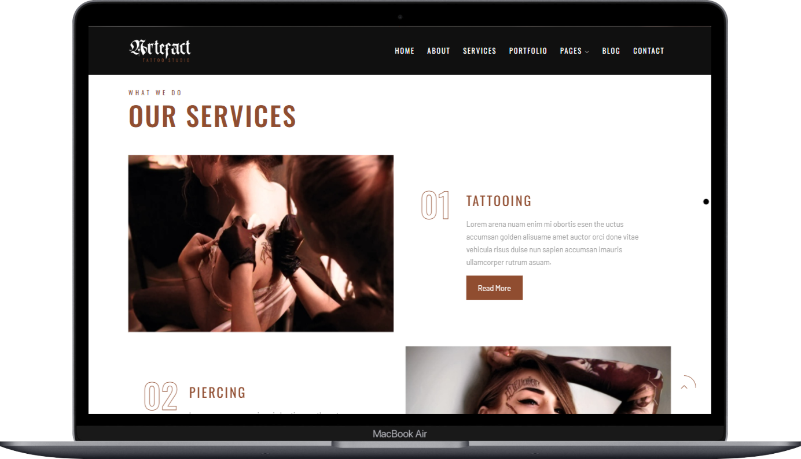
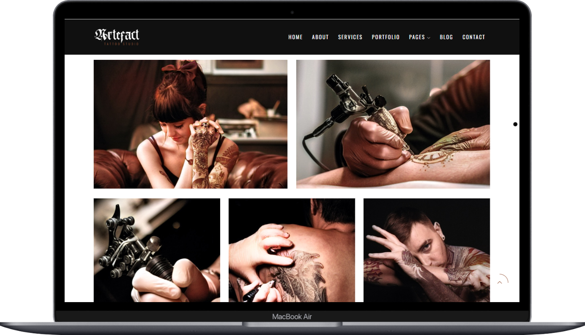
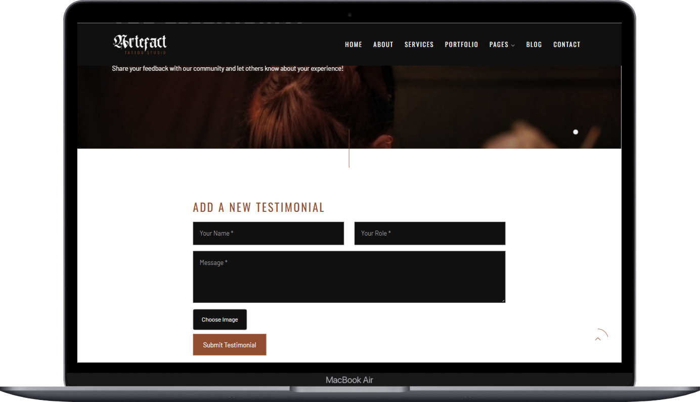
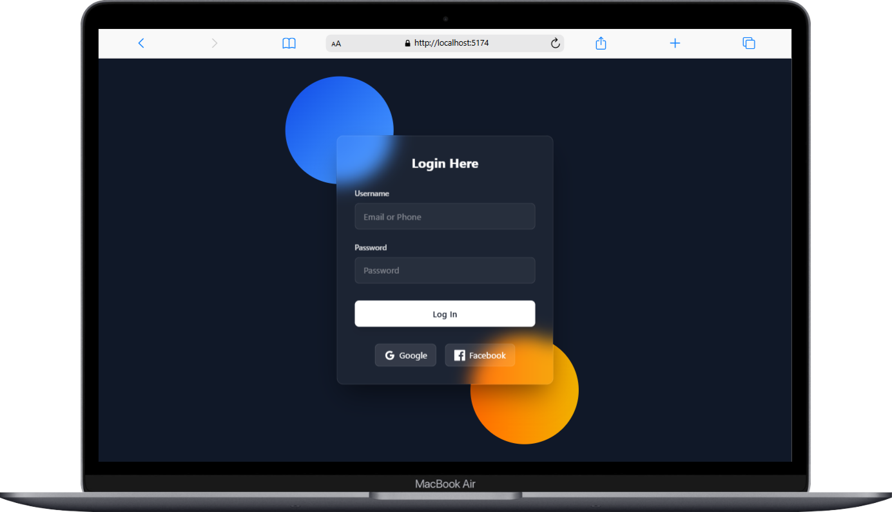
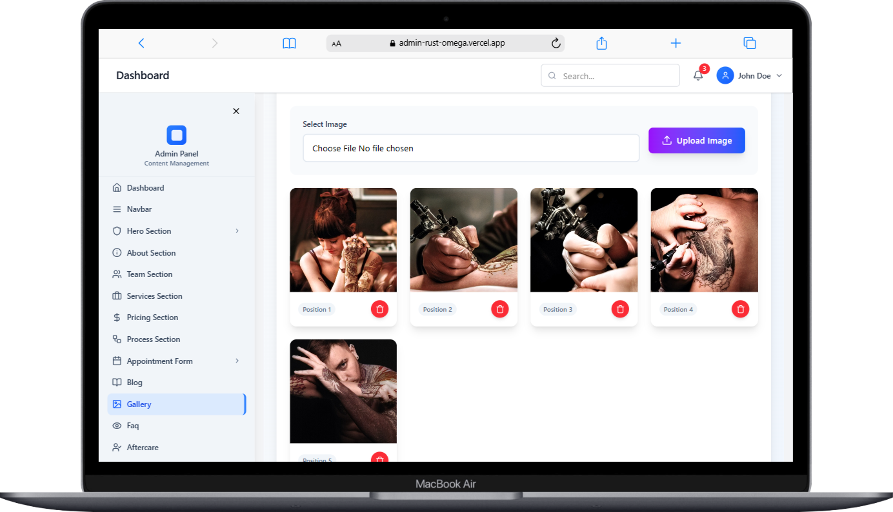
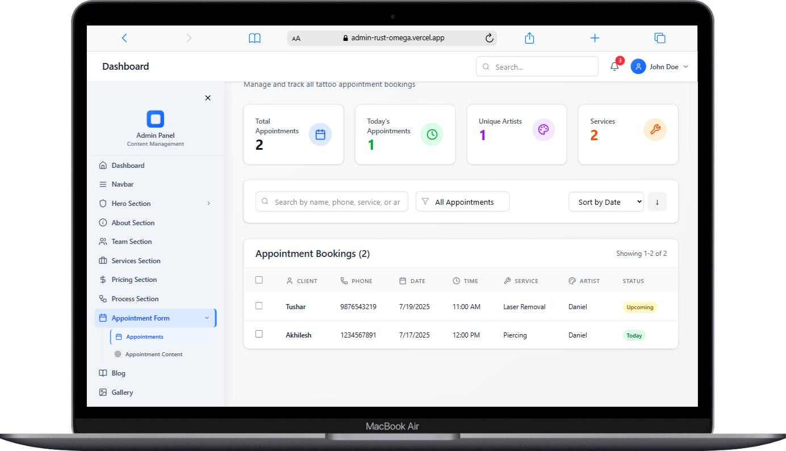

<div align="center">
  
  <h1>🎨 Tattoo Management System 🎨</h1>
  <p><b>A comprehensive web-based application designed to manage tattoo studios, bookings, and customer interactions</b></p>
  
  
</div>

---

<br/>

<div align="center">
  
  
  
  
  
</div>

---

## ✨ Features

<ul>
  <li>🎨 <b>Tattoo Portfolio Management</b> - Showcase tattoo designs and artist portfolios</li>
  <li>📅 <b>Booking System</b> - Schedule appointments and manage customer bookings</li>
  <li>👥 <b>Customer Management</b> - Track customer information and booking history</li>
  <li>🔐 <b>Admin Dashboard</b> - Comprehensive admin panel for data management</li>
  <li>📱 <b>Responsive Design</b> - Works seamlessly on desktop and mobile devices</li>
  <li>🔒 <b>Secure Authentication</b> - JWT-based authentication system</li>
  <li>🖼️ <b>Image Upload</b> - Upload and manage tattoo design images</li>
  <li>📊 <b>Analytics Dashboard</b> - Track bookings and business metrics</li>
</ul>

---

## 🖼️ Screenshots

<div align="center">
  
  
  
  
  
  
  
  
</div>

---

## 🛠️ Technology Stack

<div align="center">
  <h3>Backend</h3>
  
  
  
  
  
  

  <h3>Frontend</h3>
  
  
  
  
  

  <h3>Additional Tools</h3>
  
  
  
  
</div>

---

## 🚀 Getting Started

### Prerequisites

- Node.js (v16 or higher)
- MongoDB Atlas account or local MongoDB installation
- Git

### 📋 Complete Setup Instructions

#### 1. Clone the repository
```bash
git clone https://github.com/Akhilesh-2024/Tattoo
cd tattoo-management-system
```

#### 2. Backend Setup

```bash
# Navigate to backend directory
cd Backend

# Install dependencies
npm install

# Create environment file
cp .env.example .env
```

**Configure your `.env` file with the following variables:**
```env
PORT=5001
MONGO_URL=your_mongodb_connection_string
JWT_SECRET=your_strong_jwt_secret_key
ALLOWED_ORIGINS=http://localhost:5173,http://localhost:5174
MY_URL=http://localhost:5001
EMAIL_ADDRESS=your_admin_email@example.com
PASSWORD=your_admin_password
```

**⚠️ Important:** 
- Replace `your_mongodb_connection_string` with your actual MongoDB connection string
- Generate a strong JWT secret (use `openssl rand -hex 32`)
- Set your admin credentials for initial setup

```bash
# Start the backend server
npm start
```

The backend will be available at `http://localhost:5001`

#### 3. Frontend Setup

```bash
# Open a new terminal and navigate to frontend directory
cd Frontend

# Install dependencies
npm install

# Create environment file
cp .env.example .env
```

**Configure your Frontend `.env` file:**
```env
VITE_API_URL=http://localhost:5001
```

```bash
# Start the frontend development server
npm run dev
```

The frontend will be available at `http://localhost:5173`

#### 4. Admin Panel Setup

```bash
# Open a new terminal and navigate to admin directory
cd Admin

# Install dependencies
npm install

# Create environment file
cp .env.example .env
```

**Configure your Admin `.env` file:**
```env
VITE_API_URL=http://localhost:5001
```

```bash
# Start the admin development server
npm run dev
```

The admin panel will be available at `http://localhost:5174`

### 🔧 Database Initialization

**Important:** The frontend will not display any data initially. You need to add data through the admin panel first.

#### Initial Admin Setup

1. **Start all three servers** (Backend, Frontend, Admin)
2. **Access the admin panel** at `http://localhost:5174`
3. **Login with the credentials** you set in the Backend `.env` file:
   - Username: `EMAIL_ADDRESS` from your `.env`
   - Password: `PASSWORD` from your `.env`

#### Adding Initial Data

After logging into the admin panel, you need to add:

1. **Tattoo Categories**
   - Navigate to Categories section
   - Add different tattoo styles (Traditional, Realistic, Abstract, etc.)

2. **Artist Profiles**
   - Add artist information
   - Upload artist photos
   - Set specializations

3. **Tattoo Designs**
   - Upload tattoo images
   - Add descriptions
   - Set categories and pricing

4. **Services**
   - Add available services
   - Set pricing and duration

5. **Gallery Images**
   - Upload portfolio images
   - Organize by categories

### 🎯 Running the Complete System

To run the entire system, you need **three terminal windows**:

**Terminal 1 - Backend:**
```bash
cd Backend
npm start
```

**Terminal 2 - Frontend:**
```bash
cd Frontend
npm run dev
```

**Terminal 3 - Admin:**
```bash
cd Admin
npm run dev
```

### 🌐 Access Points

- **Frontend (Customer):** http://localhost:5173
- **Admin Panel:** http://localhost:5174
- **Backend API:** http://localhost:5001

---

## 📂 Project Structure

```text
tattoo-management-system/
├── Backend/
│   ├── src/
│   │   ├── config/           # Database configuration
│   │   ├── controllers/      # API route handlers
│   │   ├── Database/         # Database connection and admin setup
│   │   ├── Middleware/       # Authentication middleware
│   │   ├── models/           # MongoDB schemas
│   │   ├── Routes/           # API routes
│   │   ├── services/         # Business logic
│   │   ├── Upload/           # File upload handling
│   │   └── index.js          # Main server file
│   ├── .env.example          # Environment variables template
│   └── package.json
├── Frontend/
│   ├── src/
│   │   ├── Components/       # Reusable React components
│   │   ├── Pages/            # Page components
│   │   ├── hooks/            # Custom React hooks
│   │   ├── utils/            # Utility functions
│   │   └── App.jsx           # Main React component
│   ├── public/               # Static assets
│   ├── .env.example
│   └── package.json
├── Admin/
│   ├── src/
│   │   ├── Components/       # Admin-specific components
│   │   ├── Pages/            # Admin pages
│   │   └── App.jsx           # Admin main component
│   ├── public/               # Admin static assets
│   ├── .env.example
│   └── package.json
└── README.md
```

---

## 🔒 Security Features

<ul>
  <li>🔐 <b>JWT Authentication</b> - Secure token-based authentication</li>
  <li>🔑 <b>Password Hashing</b> - bcrypt for secure password storage</li>
  <li>🛡️ <b>CORS Protection</b> - Cross-origin resource sharing configuration</li>
  <li>🔒 <b>Environment Variables</b> - Sensitive data protection</li>
  <li>👮 <b>Admin Authorization</b> - Role-based access control</li>
</ul>

---

## 🗄️ Database

The application uses MongoDB with Mongoose ODM for data persistence. The database will be automatically set up when you run the backend server for the first time.

**Database Collections:**
- Users/Customers
- Tattoo Designs
- Bookings
- Artists
- Categories
- Admin Users

---

## 📱 API Endpoints

### Authentication
- `POST /api/tatto/login` - Admin login
- `POST /api/tatto/logout` - Admin logout

### Tattoo Management
- `GET /api/tatto/designs` - Get all tattoo designs
- `POST /api/tatto/designs` - Create new design
- `PUT /api/tatto/designs/:id` - Update design
- `DELETE /api/tatto/designs/:id` - Delete design

### Booking Management
- `GET /api/tatto/bookings` - Get all bookings
- `POST /api/tatto/bookings` - Create new booking
- `PUT /api/tatto/bookings/:id` - Update booking status

---

## 🎨 Customization

### Styling
- Frontend uses custom CSS with responsive design
- Admin panel has its own styling system
- Colors and themes can be customized in CSS files

### Adding New Features
1. **Backend:** Add new routes in `src/Routes/`
2. **Frontend:** Create new components in `src/Components/`
3. **Admin:** Add new admin features in Admin panel

---

## 🚨 Troubleshooting

### Common Issues

1. **Frontend shows no data**
   - ✅ Make sure to add data through admin panel first
   - ✅ Check if backend server is running
   - ✅ Verify API endpoints are accessible

2. **Cannot login to admin**
   - ✅ Check your `.env` file in Backend
   - ✅ Ensure EMAIL_ADDRESS and PASSWORD are set correctly
   - ✅ Check MongoDB connection

3. **CORS errors**
   - ✅ Verify ALLOWED_ORIGINS in backend `.env`
   - ✅ Check if frontend URLs match allowed origins

4. **Database connection issues**
   - ✅ Verify MongoDB connection string
   - ✅ Check if MongoDB service is running
   - ✅ Ensure database credentials are correct

---

## 📦 Build for Production

### Backend
```bash
cd Backend
npm run build
npm run dev
```

### Frontend
```bash
cd Frontend
npm run build
npm run dev
```

### Admin
```bash
cd Admin
npm run build
npm run dev
```

---

## 👥 Contributing

<ol>
  <li>Fork the repository</li>
  <li>Create your feature branch (<code>git checkout -b feature/amazing-feature</code>)</li>
  <li>Commit your changes (<code>git commit -m 'Add some amazing feature'</code>)</li>
  <li>Push to the branch (<code>git push origin feature/amazing-feature</code>)</li>
  <li>Open a Pull Request</li>
</ol>

---

## 📬 Contact

<p align="center">
  <a href="mailto:akhilesh0222r@gmail.com">
    
  </a>
  <a href="https://github.com/Akhilesh-2024">
    
  </a>
  <a href="https://www.linkedin.com/in/akhilesh2022">
    
  </a>
</p>

---

## 📄 License

<p align="center">
  
</p>

<p align="center">This project is licensed under the MIT License - see the LICENSE file for details.</p>

---

## ⭐ Show your support

Give a ⭐️ if this project helped you!

---

<p align="center">Made with ❤️ for the tattoo community</p>